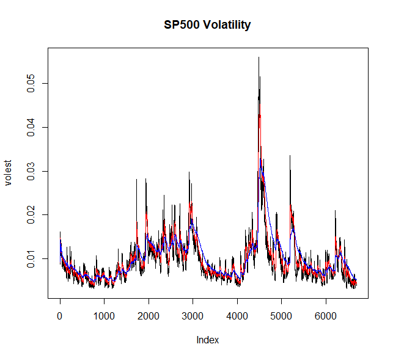
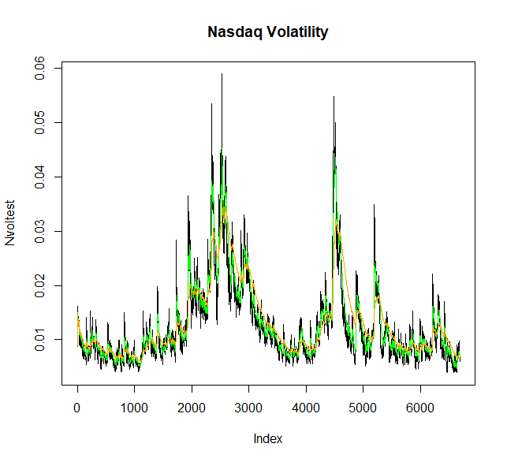

Summary
-------

This assignment focuses on calculating illustrating volatility of the S&P500 and NASDAQ over time. The code uses a custom fucntion to assign a volatility score to each daily return for the respective index being processed. The volatility scores are then plotted over time to show spikes in index volatitlity.

### Github Repository

The code and markdown documents for this assignment can be found on GitHub using the URL below: <https://github.com/georgesturrock/IndexVolatility/paper/SP500GS.md>

### Install packages and load libraries

The "tseries" library is required to get market close quotes and calculate daily returns as input in to the volatility calculation. The chunk below will only install the "tseries" package if it has not already been installed in the host environment.

``` r
# install "tseries" if not already installed
verifyinstall <- "tseries"
new.packages <- verifyinstall[!("tseries" %in% installed.packages()[,"Package"])]
if(length(new.packages)) 
  install.packages(new.packages)

library(tseries)
```

### Instantiate Volatility Function

``` r
get
Vol <- function(d, logrets)
{
    var = 0
    lam = 0
    varlist <- c()

    for (r in logrets) {
        lam = lam*(1 - 1/d) + 1

    var = (1 - 1/lam)*var + (1/lam)*r^2
        varlist <- c(varlist, var)
    }
    sqrt(varlist)
}
```

### Download data from Yahoo Finance

``` r
# Download S&P500 data
SNPdata <- get.hist.quote('^gspc',quote="Close")

# Download NADSAQ data 
NSDQdata <- get.hist.quote('^ixic',quote="Close")
```

### Calculate Log Returns

Log returns are used for this data set to accurately report gains and losses and to account for the relatively long time series.

``` r
# Calculate S&P500 log returns
SNPret <- log(lag(SNPdata)) - log(SNPdata)

# Calculate NASDAQ log returns
NSDQret <- log(lag(NSDQdata)) - log(NSDQdata)
```

### Calculate Volatility Measure

The volatility calculation takes the standard deviation of the returns, multiplies it by 250 and multiplies that by 100 to arrive at a whole number percentage. 250 is used because there are approximately 250 trading days in the fiscal year.

``` r
# Calculate S&P500 volatility measure
SNPvol <- sd(SNPret) * sqrt(250) * 100

# Calculate NASDAQ volatility measure
NSDQvol <- sd(NSDQret) * sqrt(250) * 100
```

### Calculate volatility over time for three different decay factors

Decay factors of 90%, 97% and 99% are used to estimate volatility of S&P500 and NASDAQ returns over time.

``` r
# calculate S&P500 volatility over time with three different decay factors
volest <- Vol(10,SNPret)
volest2 <- Vol(30,SNPret)
volest3 <- Vol(100,SNPret)

# calculate NASDAQ volatility over time with three different decay factors
Nvoltest <- Vol(10,NSDQret)
Nvoltest2 <- Vol(30,NSDQret)
Nvoltest3 <- Vol(100,NSDQret)
```

### Analysis and Plots

In both the S&P500 and NASDAQ plots, higher decay factors lead to smoother trend lines. This is to the expected outcome. A quick comparison between the two indices shows the NASDAQ is more volatile than the SP500. The two indices showed similar volatility between indices 4000 and 6000. However, the NASDAQ was far more volatile during indices 2000 and 3000 across all three volatility estimates.

``` r
# Plot S&P500 volatility resutls by decay factory
plot(volest,type="l", main = "SP500 Volatility", ylab = "Volatility")
lines(volest2,type="l",col="red")
lines(volest3, type = "l", col="blue")
```



``` r
# Plot NASDAQ volatility resutls by decay factory
plot(Nvoltest,type="l", main = "Nasdaq Volatility", ylab = "Volatility")
lines(Nvoltest2,type="l",col="green")
lines(Nvoltest3, type = "l", col="orange")
```


